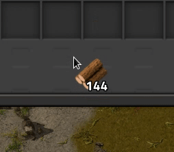
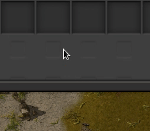

# Exact Grab for Factorio

A Factorio mod that lets you type or scroll to select an exact number of items.

Ctrl+1 then Ctrl+2 (like typing '12' with Ctrl held down) to select 12 items of the stack held in your cursor.

Ctrl+mouse wheel to 'scroll' up or down one item at a time.

Ctrl+R to recall a stack (item type, quantity) like the last one you manually selected.

More stuff/other increments can be found in Factorio's "Controls" screen when the mod is loaded.

The core method is the control.lua `apply_desired_grab` function.
